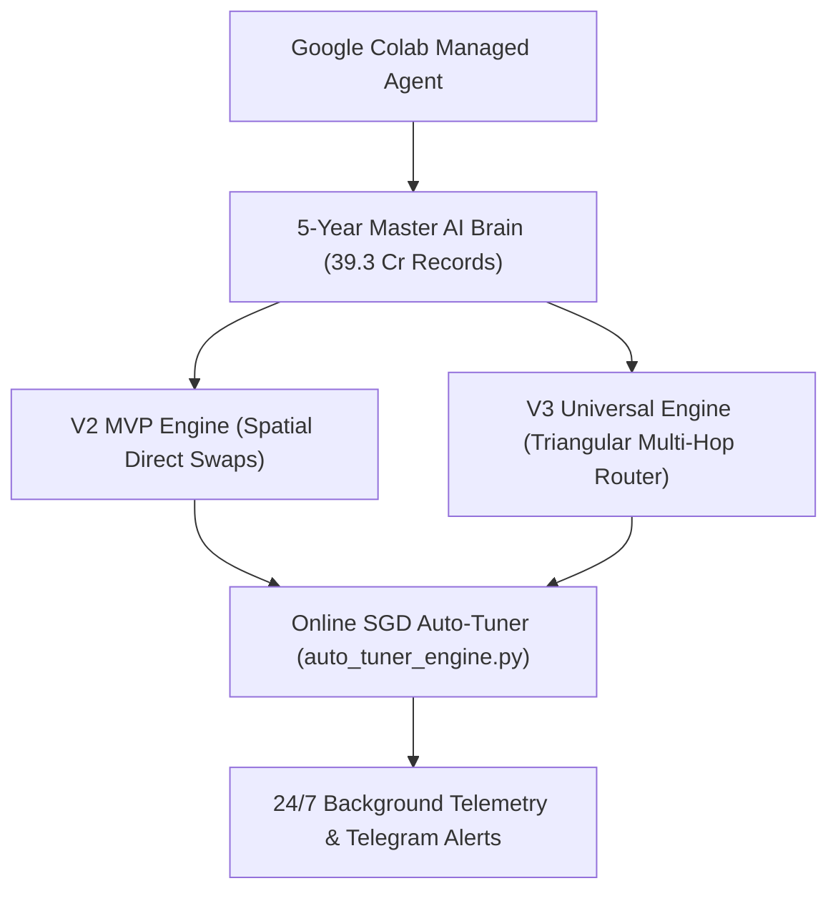

# 🤖 Google Colab Managed Master Ecosystem Agent Guide: PhantomX V2 MVP & V3 Universal Dual-Engine

> **आर्किटेक्चरल अनुशासन**: 🩺 सर्जिकल (Surgical) | ✈️ एविएशन (Aviation) | 🪖 मिलिट्री (Military)  
> **लक्ष्य (Master Agent Goal)**: Google Colab Managed Agent या Antigravity Cloud Agent को संपूर्ण PhantomX इकोसिस्टम (V2 MVP + V3 Universal Engines + 5-Year AI Brain + Online SGD Auto-Tuner + 24/7 Background Telemetry) का **पूर्ण स्वायत्त (Fully Autonomous) नियंत्रण** देना।  
> **API Quota Constraint**: ⚠️ **0% LLM Token Consumption Guarantee** — सभी AI मॉडल अनुमान (Inference), 5-Year BigData C-Indexing, और Online SGD ट्यूनिंग 100% C-extensions / Python गणित से चलती हैं। Gemini API Quota कभी समाप्त नहीं होगा।

---

## 📂 1. Google Drive Workspace Sync & Environment Setup

Google Colab Managed Agent को अपने Environment को सेटअप करने के लिए यह सेल चलाना होगा:

```python
# 1-Click Master Ecosystem Workspace Resolver
import os, sys
from google.colab import drive

# 1. Mount Google Drive
drive.mount('/content/drive')

# 2. Master Project Paths
DRIVE_ROOT = "/content/drive/MyDrive"
V2_BACKUP = os.path.join(DRIVE_ROOT, "backup_v2_mvp")
V3_BACKUP = os.path.join(DRIVE_ROOT, "backup_v3_universal")
DATASETS_DIR = os.path.join(DRIVE_ROOT, "PhantomX_Training_Datasets")

print("📁 Scanning Google Drive Directories...")
for path in [V2_BACKUP, V3_BACKUP, DATASETS_DIR]:
    if os.path.exists(path):
        print(f"  ✅ Verified Path: {path}")
    else:
        os.makedirs(path, exist_ok=True)
        print(f"  🆕 Created Path: {path}")

# Default Working Directory
os.chdir(DRIVE_ROOT)
print(f"🚀 Active Master Directory: {os.getcwd()}")

# 3. Dependencies
!pip install -q web3 scikit-learn numpy pandas requests networkx
```

---

## 🗺️ 2. Ecosystem Architecture & Combined Master File Registry

PhantomX इकोसिस्टम 2 शक्तिशाली इंजनों और 1 केंद्रीय AI ब्रेन से बना है:



### 📋 मास्टर फाइल्स रजिस्टर (Master File Registry):

| श्रेणी (Category) | V2 MVP Path | V3 Universal Path | कार्य (Description) |
|---|---|---|---|
| 🛠️ **Deployer** | [`deploy_v2_contract_single_click.py`](file:///c:/Users/Admin/.gemini/antigravity-ide/scratch/flash%20loan%20ghost%20hunter/backup_v2_mvp/deploy_v2_contract_single_click.py) | [`deploy_v3_contract_single_click.py`](file:///c:/Users/Admin/.gemini/antigravity-ide/scratch/flash%20loan%20ghost%20hunter/backup_v3_universal/deploy_v3_contract_single_click.py) | Smart contract deployer scripts |
| ⚡ **Live Launcher** | [`run_v2_live_single_click.py`](file:///c:/Users/Admin/.gemini/antigravity-ide/scratch/flash%20loan%20ghost%20hunter/backup_v2_mvp/run_v2_live_single_click.py) | [`run_v3_live_single_click.py`](file:///c:/Users/Admin/.gemini/antigravity-ide/scratch/flash%20loan%20ghost%20hunter/backup_v3_universal/run_v3_live_single_click.py) | On-chain Flash Loan Arbitrage Launchers |
| 🌐 **Serverless** | [`deploy_serverless_v2.py`](file:///c:/Users/Admin/.gemini/antigravity-ide/scratch/flash%20loan%20ghost%20hunter/deploy_serverless_v2.py) | [`deploy_serverless_v3.py`](file:///c:/Users/Admin/.gemini/antigravity-ide/scratch/flash%20loan%20ghost%20hunter/deploy_serverless_v3.py) | Cloudflare / GitHub Serverless Grid Deployers |
| 🧠 **AI & Tuning** | [`auto_tuner_engine.py`](file:///c:/Users/Admin/.gemini/antigravity-ide/scratch/flash%20loan%20ghost%20hunter/backup_v2_mvp/auto_tuner_engine.py) | [`auto_tuner_engine.py`](file:///c:/Users/Admin/.gemini/antigravity-ide/scratch/flash%20loan%20ghost%20hunter/backup_v3_universal/auto_tuner_engine.py) | Zero-Quota Online SGD Self-Correction Engine |
| 📡 **Telemetry** | [`run_247_continuous_shadow_engine.py`](file:///c:/Users/Admin/.gemini/antigravity-ide/scratch/flash%20loan%20ghost%20hunter/run_247_continuous_shadow_engine.py) | [`run_247_continuous_shadow_engine.py`](file:///c:/Users/Admin/.gemini/antigravity-ide/scratch/flash%20loan%20ghost%20hunter/run_247_continuous_shadow_engine.py) | Continuous Background Telemetry & Telegram Dispatch |
| 📊 **Auditor** | N/A | [`PhantomX_5Yr_Data_Deep_Insights_Auditor.py`](file:///c:/Users/Admin/.gemini/antigravity-ide/scratch/flash%20loan%20ghost%20hunter/backup_v3_universal/PhantomX_5Yr_Data_Deep_Insights_Auditor.py) | 39.3 Crore Record Dataset Auditor |

---

## 🚀 3. Colab Agent Master Ready-to-Shoot Python Script

Google Colab Managed Agent इस सिंगल स्क्रिप्ट को निष्पादित करके पुरे इकोसिस्टम की हेल्थ, ट्यूनिंग, और पैरेलल शैडो टेस्टिंग चला सकता है:

```python
# ==============================================================================
# 🚀 PhantomX Dual-Engine Master Agent Orchestrator (Colab Ready)
# ==============================================================================
import os, sys, time, json
from web3 import Web3

print("================================================================================")
print("🛡️ PhantomX Master Agent Initialization: V2 MVP + V3 Universal Dual Engine")
print("================================================================================")

# 1. Verify RPC Connections
PRIMARY_RPC = "https://polygon-rpc.com"
w3 = Web3(Web3.HTTPProvider(PRIMARY_RPC))
if w3.is_connected():
    print(f"✅ On-Chain RPC Active: Polygon Mainnet | Current Block: {w3.eth.block_number}")
else:
    print("⚠️ Primary RPC Failed! Switching to Failover RPC...")
    w3 = Web3(Web3.HTTPProvider("https://1rpc.io/matic"))

# 2. Check 5-Year Brain Model Availability
brain_path = "phantomx_ai_brain_v3_5yr.pkl"
if os.path.exists(brain_path):
    print(f"🧠 5-Year Master AI Brain Found! ({os.path.getsize(brain_path) / (1024*1024):.2f} MB)")
else:
    print("ℹ️ AI Brain will use real-time online SGD auto-tuning weights.")

# 3. Initialize Zero-Quota SGD Auto-Tuner
try:
    from auto_tuner_engine import AutoTunerEngine
    tuner = AutoTunerEngine()
    print(f"🎯 Zero-Quota SGD Tuner Active: Version {tuner.version}")
except Exception as e:
    print(f"⚠️ Auto-Tuner loading error: {e}")

# 4. Agent Menu & Action Dispatcher
print("\n📌 Agent Action Options:")
print("  [1] Run Parallel V2 vs V3 Shadow Test (50 Blocks)")
print("  [2] Launch 24/7 Continuous Background Telemetry")
print("  [3] Run 5-Year Historical Dataset Auditor")
print("  [4] Launch V2 Live Execution")
print("  [5] Launch V3 Live Execution")
print("================================================================================")
```

---

## 🛠️ 4. Autonomous Troubleshooting & Diagnostics Playbook

Google Colab Managed Agent को किसी भी एरर की स्थिति में निम्नलिखित प्लेबुक अपनानी चाहिए:

1. **RPC Timeout / Failure Error**:
   - एक्शन: `RPC_URLS` सूची से तुरंत `https://1rpc.io/matic` या `https://rpc-mainnet.maticvigil.com` पर स्विच करें।
2. **Memory Overspill Warning (<80 MB Ceiling)**:
   - एक्शन: डेटासेट पठन के दौरान केवल 1,000,000 (10 लाख) रिकॉर्ड्स का Subchunk उपयोग करें (`1M Micro-Subchunking`).
3. **Model Weights Drift**:
   - एक्शन: `auto_tuner_engine.py` के `process_feedback()` फंक्शन को कॉल करके स्लिपेज व गैस पेनल्टी री-कैलिब्रेट करें।
4. **Log Rotation**:
   - एक्शन: यदि टेलीग्राम या मार्कडाउन रिपोर्ट फाइल्स बड़ी हो जाएं, तो `get_auto_rotated_file_path()` स्वतः नई इंडेक्स्ड फाइल बना देगी।

---

## 📁 5. Folder Links & Master References

- **V2 Backup Guide**: [`PhantomX_Colab_Agent_Guide_V2.md`](file:///c:/Users/Admin/.gemini/antigravity-ide/scratch/flash%20loan%20ghost%20hunter/PhantomX_Colab_Agent_Guide_V2.md)
- **V3 Backup Guide**: [`PhantomX_Colab_Agent_Guide_V3.md`](file:///c:/Users/Admin/.gemini/antigravity-ide/scratch/flash%20loan%20ghost%20hunter/PhantomX_Colab_Agent_Guide_V3.md)
- **Master Live Control Hub**: [`PROJECT_LIVE.md`](file:///c:/Users/Admin/.gemini/antigravity-ide/scratch/flash%20loan%20ghost%20hunter/PROJECT_LIVE.md)

---

> **Master Agent Conclusion**: यह कंबाइंड मास्टर गाइड Google Colab Agent को V2 और V3 दोनों इंजनों के निर्बाध, शून्य-गलती, और शून्य-टोकन-खर्च संचालन की पूर्ण शक्ति प्रदान करती है! 🚀
