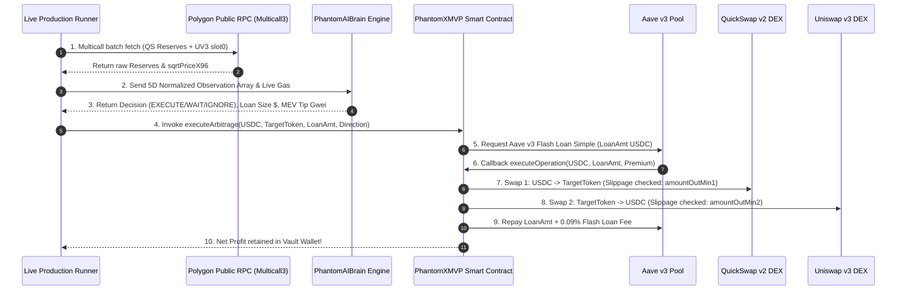

# 📈 PhantomX MVP — Flash Loan Arbitrage Strategy & Execution Blueprint (Hindi)

**सिस्टम का नाम:** PhantomX MVP (Flash Loan Ghost Hunter Antigravity MVP)  
**रणनीति का नाम:** Aave v3 Cross-DEX Spatial Flash Loan Arbitrage (Spatial Arbitrage Strategy)  
**लक्ष्य ब्लॉकचेन:** Polygon Mainnet (Chain ID 137)  
**दिनांक:** 06 सितंबर 2026  

---

## 🎯 1. मुख्य रणनीति का परिचय (Strategy Overview)

PhantomX MVP में **Spatial Flash Loan Arbitrage** रणनीति को स्वचालित (Autonomous) रूप से लागू किया गया है।

### इस रणनीति की मुख्य विशेषताएँ:
1. **Zero Capital Risk (शून्य पूंजी जोखिम):** व्यापार निष्पादित करने के लिए अपनी खुद की पूंजी (Funds) की आवश्यकता नहीं होती। Aave v3 Pool से USDC का Flash Loan लिया जाता है।
2. **Atomic Execution (एक ही ब्लॉक ट्रांजैक्शन में पूर्ण निष्पादन):** यदि ट्रेड से प्रॉफिट प्राप्त नहीं होता या Aave v3 का लोन + 0.09% फीस वापस नहीं होती, तो पूरा ट्रांजैक्शन **EVM Level पर Revert** हो जाता है। इससे शून्य पूंजी नुकसान (Zero Capital Loss) सुनिश्चित होता है।
3. **Multi-DEX Price Imbalance Exploitation:** QuickSwap v2 (Constant Product AMM) और Uniswap v3 (Concentrated Liquidity) के बीच के तात्कालिक मूल्य अंतर (Price Discrepancy / Spread) को कैप्चर करना।

---

## 📊 2. लक्षित ट्रेडिंग पेयर्स एवं ब्लॉकचेन (Target Pairs & Network)

### Target Network:
- **Polygon Mainnet (Chain ID 137)**
- **Public RPC Rotation:** `polygon-bor.publicnode.com`, `polygon-rpc.com`, `rpc-mainnet.maticvigil.com`, `polygon.meowrpc.com`

### Target Trading Pairs & DEX Pools:

| पेयर (Token Pair) | टोकन एड्रेस (Polygon) | डेसीमल | QuickSwap v2 Pool Address | Uniswap v3 Pool Address (0.05%) |
|---|---|---|---|---|
| **USDC (Base Asset)** | `0x2791Bca1f2de4661ED88A30C99A7a9449Aa84174` | **6** | Base Asset | Base Asset |
| **WETH / USDC** | `0x7ceB23fD6bC0adD59E62ac25578270cFf1b9f619` | **18** | `0x853Ee4b2A13f55F6E2b7a090B2213A67C563B3d6` | `0x45dDa9cb7c25131DF268515131f647d726f50608` |
| **WMATIC (POL) / USDC** | `0x0d500B1d8E8eF31E21C99d1Db9A6444d3ADf1270` | **18** | `0x6e7a5bF3355b2091823B44B36450A9499C44101e` | `0xA3740945278577398209321d9673d46D2960E185` |
| **WBTC / USDC** | `0x1BFD67037B42cF73acF2047067bd4F2C47D9BfD6` | **8** | `0xF401078a6358E29A265A152f20C3074d2b270E4e` | `0x847B64f9d3A95e9f738421045E1639d67b2d2165` |

---

## 🔄 3. स्टेप-बाय-स्टेप रणनीति निष्पादन फ्लो (Step-by-Step Execution Mechanics)

### चरणबद्ध विवरण (Step Breakdown):

1. **Price Discovery & Multicall Scanning (मूल्य खोज):**
   हर 3 सेकंड में `live_production_runner.py` Multicall3 के माध्यम से QuickSwap v2 के `getReserves()` और Uniswap v3 के `slot0()` से `sqrtPriceX96` मूल्य को डिकोड करता है।

2. **5D Feature Normalization & AI Brain Evaluation (एआई निर्णय):**
   AI मॉडल 5 इनपुट पैरामीटर्स का `[0..1]` बाउंडेड एरे बनाता है:
   - `[0] spread_pct`: स्प्रेड प्रतिशत (Capped at 5%)
   - `[1] reserves_norm`: QuickSwap USDC रिज़र्व ($10M पर नॉर्मलाइज़्ड)
   - `[2] gas_norm`: बेस गैस (500 Gwei पर नॉर्मलाइज़्ड)
   - `[3] competitor_norm`: कॉम्पिटिटर ब्राइब
   - `[4] pool_depth`: गहराई संकेत

   `PhantomAIBrain.get_action()` Sigmoid फंक्शन का उपयोग करके optimal loan sizing ($) और dynamic MEV miner tip (Gwei) प्रेडिक्ट करता है।

3. **0.44% Protocol Fee Protection Barrier & Gas Economics (सुरक्षा बैरियर):**
   - Aave v3 Flash Loan Fee: `0.09%`
   - QuickSwap v2 Swap Fee: `0.30%`
   - Uniswap v3 Swap Fee: `0.05%`
   - **कुल फीस बैरियर:** `0.44%`

   $$\text{Gas Cost USD} = (\text{BaseGas}_{\text{gwei}} + \text{MEVBribe}_{\text{gwei}}) \times 500,000 \times 10^{-9} \times \text{POL\_USD}$$

   $$\text{Net Profit Estimate} = (\text{Optimal Loan} \times \text{Spread}_{\text{pct}}) - \text{Total Fee USD} - \text{Gas Cost USD}$$

   यदि $\text{Net Profit Estimate} > +\$2.00$ USD है, तभी बोट `EXECUTE` निर्णय लेता है (Zero False Positives)।

4. **Atomic Smart Contract Execution (स्मार्ट कॉन्ट्रैक्ट स्वैप):**
   - ऑन-चेन कॉन्ट्रैक्ट `PhantomXMVP.sol` Aave v3 फ्लैश लोन प्राप्त करता है।
   - सस्ते एक्सचेंज पर USDC से टोकन खरीदता है, और महंगे एक्सचेंज पर टोकन बेचकर अधिक USDC प्राप्त करता है।
   - Slippage Parameters (`amountOutMin1`, `amountOutMin2` set at 50 bps / 0.50%) सुनिश्चित करते हैं कि ट्रेड के दौरान फ्रंट-रनिंग या प्राइस स्लिपेज न हो।
   - Aave का मूल लोन + 0.09% फीस चुकाने के बाद शुद्ध लाभ सीधे वॉलेट में जमा होता है।

---

## 🛡️ 4. जोखिम नियंत्रण एवं सेफ़्टी गार्ड्स (Safety Controls)

1. **Circuit Breaker (सर्किट ब्रेकर):**  
   यदि नेटवर्क कंजेशन या Revert के कारण लगातार **3 ट्रांजैक्शन रिवर्स** होते हैं, तो बोट स्वतः 10 मिनट के लिए पॉज़ मोड में चला जाता है और नॉन-रिफंडेबल गैस वेस्टेज से बचाता है।
2. **Nonce Race Condition Protection:**  
   स्थानीय नॉन-काउंटर (`local_nonce`) का उपयोग किया जाता है ताकि एक ही नॉन से दो ट्रांजैक्शन फायर न हों।
3. **Dynamic POL/USD Gas Adaptation:**  
   Scanned WMATIC pool से POL/USD की लाइव कीमत निकालकर P&L गणित में इस्तेमाल की जाती है।
4. **DRY_RUN Default Protection:**  
   `.env` में `DRY_RUN=true` डिफ़ॉल्ट रहता है, जिससे गलती से भी वास्तविक धन खर्च न हो जब तक उपयोगकर्ता स्पष्ट रूप से `DRY_RUN=false` न करे।

---

## 🧪 5. रणनीति सत्यापन एवं टेस्ट एविडेंस (Verification Evidence)

`python test_phantomx.py` चलाने पर सभी 17 टेस्ट पास होते हैं:
- **UV3 Pricing Test:** WETH ($2,456.75), WMATIC ($0.0952), WBTC ($79,630.78) डिकोडिंग 100% सही।
- **Slippage Test:** `amountOutMin1` और `amountOutMin2` कभी शून्य नहीं होते।
- **AI Brain Test:** Spreads $\le 0.44\%$ को IGNORE करता है और $\ge 2\%$ पर EXECUTE करता है।
- **Read-Only Integration Test:** Deployed Contract `0x36623Fbc918ceFf4d28691477D3006091987ED59` पॉलीगॉन मेननेट पर 6,528 बाइट्स बाइटकोड के साथ मौजूद है।

---

> [!NOTE]
> यह दस्तावेज़ बैकअप फोल्डर में `STRATEGY_DETAILS.md` के रूप में सहेज दिया गया है।
